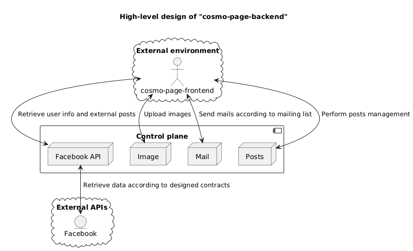
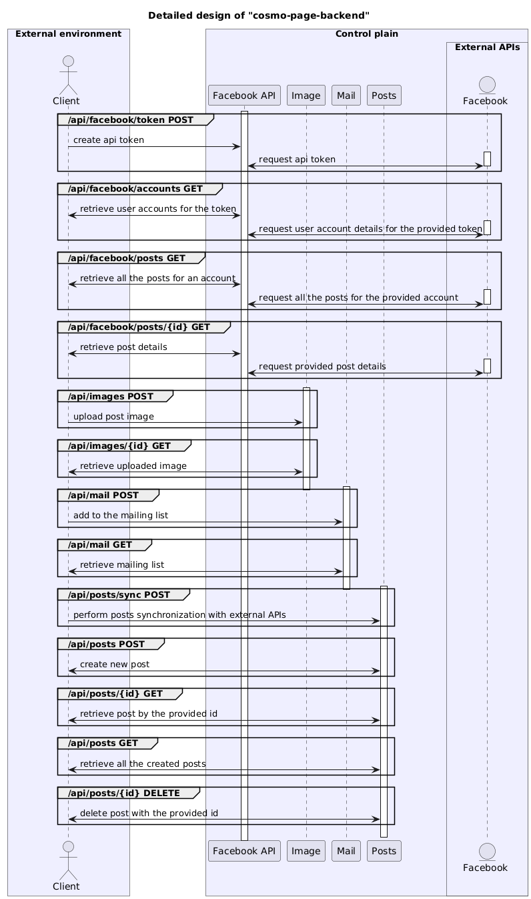

# cosmo-page-backend

## General Information

Contains an implementation for an API service used by cosmo-page infrastructure.

Before deploying the Spring Boot application, ensure that you have the following prerequisites installed and configured on your deployment environment:





## Prerequisites

- **JDK 21**
- **Docker + Docker Compose** — required for `docker compose` flows and for the integration tests
  (Testcontainers spins up a real Postgres). The application itself can run without Docker.
- **PostgreSQL** (or use the one started by Compose)
- **No global Maven needed** — the project ships the Maven wrapper (`./mvnw` / `mvnw.cmd`).

---

## Running the application

Every supported way to run, test and build the app. Pick the scenario that matches what you want
to do.

| Scenario | Section |
| --- | --- |
| Local development, everything in Docker (easiest) | [1. Full stack via Docker Compose](#1-local-development--full-stack-via-docker-compose) |
| Local development, backend on host (hot reload) | [2. Postgres in Docker + backend on host](#2-local-development--postgres-in-docker--backend-on-host) |
| Run the tests | [3. Tests](#3-tests) |
| Build the jar only | [4. Build](#4-build) |
| Run the jar with the `prod` profile | [5. Run the jar (bare metal)](#5-run-the-jar-bare-metal) |
| Run the Docker image directly | [6. Run the Docker image](#6-run-the-docker-image) |
| Which profile to pick | [7. Profiles](#7-profiles) |
| All configuration knobs | [8. Environment variables](#8-environment-variables) |
| Facebook emulator vs real API | [9. Facebook emulator vs real API](#9-facebook-emulator-vs-real-api) |
| Problems? | [10. Troubleshooting](#10-troubleshooting) |

### 1. Local development — full stack via Docker Compose

The fastest way to start. One command runs **Postgres + the backend**.

```shell
docker compose up -d --build
```

| What | Where |
| --- | --- |
| Backend API | http://localhost:8080 |
| Swagger UI | http://localhost:8080/swagger-ui.html |
| Postgres | `localhost:5432` (`postgres` / `postgres`, DB `cosmo_backend`) |

- The backend starts with the **`local`** profile: Facebook API is **emulated**, sample posts are
  seeded automatically, **no environment variables are required**, and **no API key is required**
  (`api-keys-required=false`).
- Postgres data lives in the named volume `postgres-data`, so it survives `docker compose down`.

> **Click-to-test:** a ready Postman collection with every endpoint, sample bodies and variables is
> shipped in [`postman/cosmo-page-backend.postman_collection.json`](./postman/cosmo-page-backend.postman_collection.json).
> Import it, start the app, and click — no need to type requests by hand.

Useful commands:

```shell
docker compose ps                 # status of all services
docker compose logs -f backend    # follow backend logs
docker compose down               # stop (database data is kept)
docker compose down -v            # stop AND wipe the database volume
docker compose up -d --build      # rebuild and start after code changes
```

### 2. Local development — Postgres in Docker + backend on host

Use this when you want the backend running directly on your machine (faster restarts, hot reload
via `spring-boot-devtools`, easier debugging in your IDE).

1. Start only the database:

```shell
docker compose up -d postgres
```

2. Run the backend from the host with the `local` profile:

```shell
# Linux / macOS
SPRING_PROFILES_ACTIVE=local ./mvnw spring-boot:run

# Windows PowerShell
$env:SPRING_PROFILES_ACTIVE="local"
.\mvnw.cmd spring-boot:run
```

The `local` profile connects to `jdbc:postgresql://localhost:5432/cosmo_backend`
(`postgres` / `postgres`), enables the Facebook emulator and hot reload.

> Tip: in IntelliJ IDEA you can also create a Spring Boot run configuration and set the **active
> profile** to `local`.

### 3. Tests

All tests need Docker (Testcontainers starts a `postgres:16` container).

```shell
# everything: unit + integration + contract tests + coverage gate
./mvnw clean verify

# unit tests only
./mvnw test

# integration tests only
./mvnw verify -Dit.test='*IT'

# one integration test class
./mvnw verify -Dit.test='PostIT'
```

What runs during `verify`:

- **Unit tests** (`src/test`) — mocked service/mapper logic.
- **Integration tests** (`src/integration-tests`) — real HTTP calls against a real Postgres
  (Testcontainers): posts, users, images, webhook handshake, health.
- **Contract tests** (`ContractsIT`) — validates that HTTP responses match the canonical OpenAPI
  spec (`src/main/resources/schemas.yml`).
- **JaCoCo** — coverage report and a minimum coverage gate.

Reports: test reports in `target/surefire-reports` and `target/failsafe-reports`; coverage report
at `target/site/jacoco/index.html`.

### 4. Build

```shell
# full build (jar + tests)
./mvnw clean install

# build the jar without running tests
./mvnw clean package -DskipTests
```

The executable jar is produced at `target/cosmo-backend-0.0.1-SNAPSHOT.jar`.

### 5. Run the jar (bare metal)

Used for production-like runs outside Docker, or anywhere you run the jar directly.

1. Make sure a Postgres instance is reachable and set the required variables
   ([8. Environment variables](#8-environment-variables)): `POSTGRES_URL`, `POSTGRES_USERNAME`,
   `POSTGRES_PASSWORD`, `API_KEYS`, `PROD_URL`, `FB_TOKEN` (+ `FB_PAGE_TOKEN` / `FB_PAGE_ID` when
   you don't store the token via the API).

2. Run with the `prod` profile:

```shell
# Linux / macOS
SPRING_PROFILES_ACTIVE=prod \
POSTGRES_URL=jdbc:postgresql://... \
POSTGRES_USERNAME=... POSTGRES_PASSWORD=... \
API_KEYS=... PROD_URL=https://cosmopk.pl FB_TOKEN=... \
java -jar target/cosmo-backend-0.0.1-SNAPSHOT.jar

# Windows PowerShell
$env:SPRING_PROFILES_ACTIVE="prod"
$env:POSTGRES_URL="jdbc:postgresql://..."
# ... set the remaining variables ...
java -jar target\cosmo-backend-0.0.1-SNAPSHOT.jar
```

Alternatively use the **`.env` file** — the `spring-dotenv` dependency reads it automatically from
the working directory (see `.env.example`):

```shell
cp .env.example .env    # fill in the values
java -Dspring.profiles.active=prod -jar target/cosmo-backend-0.0.1-SNAPSHOT.jar
```

> In `prod` the database schema is managed by **Flyway** (`ddl-auto: validate`). A fresh database
> is created automatically from `src/main/resources/db/migration`. Swagger is disabled and actuator
> exposes only `health` and `info`.

### 6. Run the Docker image

The image is built from the `Dockerfile` (Java 21, runs as non-root `cosmopk`).

Build the image locally:

```shell
docker build -t cosmopk/cosmo-page-backend .
```

> The build accepts a `GIT_COMMIT` build-arg (the CI pipeline passes `github.sha`). When set it is
> baked into `git.properties` so `GET /actuator/info` reports the deployed commit even though the
> build context contains no `.git` directory. Local builds without the arg report `unknown`.

Run with the `prod` profile (env from a file):

```shell
docker run -d --name cosmo-backend \
  -p 8080:8080 \
  --env-file .env-prod \
  --restart unless-stopped \
  cosmopk/cosmo-page-backend
```

Run locally against Postgres running on the host:

```shell
docker run -d --name cosmo-backend -p 8080:8080 \
  -e SPRING_PROFILES_ACTIVE=local \
  -e SPRING_DATASOURCE_URL=jdbc:postgresql://host.docker.internal:5432/cosmo_backend \
  -e SPRING_DATASOURCE_USERNAME=postgres \
  -e SPRING_DATASOURCE_PASSWORD=postgres \
  --restart unless-stopped \
  cosmopk/cosmo-page-backend
```

> `host.docker.internal` points from the container to your machine. On Linux you may need
> `--add-host=host.docker.internal:host-gateway`.

Verify it is up:

```shell
curl http://localhost:8080/actuator/health   # -> {"status":"UP", ...}
```

### 7. Profiles

| Profile | When to use | Datasource | Facebook | Flyway | API key | Swagger |
| --- | --- | --- | --- | --- | --- | --- |
| `local` | local development | `localhost:5432` (`postgres`/`postgres`) | emulated | off (`ddl-auto: update`) | not required | on |
| `test` | integration tests only | Testcontainers Postgres | emulated | on + `ddl-auto: validate` | required | n/a |
| `prod` | production | `POSTGRES_URL` env | real | on + `ddl-auto: validate` | **required** | off |
| *(none)* | manual run with env vars | `POSTGRES_URL` env | real (emulator off by default) | off | optional | on |

The default/base configuration lives in `application.yml`; profile-specific files are
`application-local.yml` and `application-prod.yml`. The `test` profile is only used by the
integration tests.

### 8. Environment variables

| Variable | Required | Description | Default |
| --- | --- | --- | --- |
| `SPRING_PROFILES_ACTIVE` | dev/local | active profile (`local` or `prod`) | *none* |
| `POSTGRES_URL` | prod | JDBC URL (`jdbc:postgresql://host:5432/db`) | — |
| `POSTGRES_USERNAME` | prod | DB user | — |
| `POSTGRES_PASSWORD` | prod | DB password | — |
| `API_KEYS` | prod | comma-separated accepted API keys (`apiKey` header) | empty |
| `API_KEYS_REQUIRED` | — | reject requests without a valid key; `true` + empty `API_KEYS` fails startup (fail closed) | `false` (`true` in prod) |
| `CORS_ALLOWED_ORIGINS` | — | comma-separated allowed origins | `http://localhost:4200,https://cosmopk.pl` |
| `FB_TOKEN` | prod | Facebook webhook verify token | empty |
| `FB_PAGE_TOKEN` | optional | page access token (startup fallback) | empty |
| `FB_PAGE_ID` | optional | Facebook page id (startup fallback) | empty |
| `CLIENT_ID` / `CLIENT_SECRET` | optional | Facebook app credentials | empty |
| `PROD_URL` | prod | public URL of the API | `http://localhost:8080` |
| `POSTGRES_HOST_PORT` | local | host port for the compose Postgres | `5432` |
| `JAVA_OPTS` | optional | JVM flags for the container (`java $JAVA_OPTS -jar ...`) | empty |
| `MESSENGER_RECIPIENT_ID` | k8s crash-watcher | Messenger thread id of the alert group (Graph API `recipient.id`, e.g. `t_id_...`); required for the CronJob to start | empty |
| `FB_API_VERSION` | k8s crash-watcher | Facebook Graph API version used by the notifier | `v21.0` |

### 9. Facebook emulator vs real API

- **`local` / `test`** — `facebook.emulator.enabled=true`. The Facebook Graph API is emulated:
  sample posts are served and the database is seeded automatically. `POST /api/posts/sync`,
  `GET /api/posts` and `GET /api/facebook/posts` all work without any Facebook credentials or
  network access to Facebook. The emulator is **opt-in**: the base config disables it, so any
  profile that does not explicitly enable it uses the real client.
- **`prod`** — `facebook.emulator.enabled=false`. The real Graph API is used; `FB_TOKEN` (webhook
  verify) is required and `FB_PAGE_TOKEN` + `FB_PAGE_ID` are used as the startup fallback when no
  token is stored in the database yet.

> **Schema migrations (prod):** the `prod` profile uses **Flyway** migrations
> (`src/main/resources/db/migration`) and `spring.jpa.hibernate.ddl-auto: validate`. Never rely on
> Hibernate auto-DDL in production — add a new `V<next>__*.sql` migration for schema changes.
> Existing databases are automatically baselined (`baseline-on-migrate`), so the first deploy
> requires no manual step.
>
> **API key enforcement:** in `prod` requests without a valid `apiKey` header are rejected
> (`API_KEYS_REQUIRED=true`). If the key list is empty while enforcement is on, the application
> refuses to start — the API fails closed instead of silently accepting every request.

### 10. Troubleshooting

| Problem | Fix |
| --- | --- |
| `Failed to configure a DataSource` at startup | No profile / datasource configured. Set `SPRING_PROFILES_ACTIVE=local` (compose/host) or provide `POSTGRES_URL`+credentials. |
| Backend container restarts / unhealthy | Postgres not ready yet — check `docker compose ps` (Postgres must be `healthy`). |
| `401 Unauthorized` on every request (prod) | `API_KEYS` does not match the `apiKey` header the client sends. |
| App refuses to start with *"API keys are required but no API_KEYS are configured"* | `API_KEYS_REQUIRED=true` with an empty `API_KEYS` — the fail-closed guard rejects this; provide the key list. |
| `401` on `/api/user...` even with a valid `apiKey` | The `user_id` and `access_token` headers are missing or rejected (Facebook user authentication). |
| Swagger UI 404 | Disabled by design in the `prod` profile. Use `local`. |
| Tests fail with "Docker environment" error | Docker daemon not running — start Docker Desktop / Docker engine. |
| Database data gone | `docker compose down -v` wipes the `postgres-data` volume (intentional reset). |
| `Schema validation failed` / Flyway migration error (prod) | The DB schema does not match the entities. Add a new `V<next>__*.sql` migration instead of relying on `ddl-auto`. |
| I want to know which commit is deployed | `curl http://localhost:8080/actuator/info` reports the git commit (prod exposes `health` + `info`). |
| Pod restarts in a loop (`CrashLoopBackOff`) | `kubectl -n cosmo logs deployment/backend --previous`. Typical causes: Flyway schema validation, bad env config, OOM. While down the pod is cut off from traffic by the readiness probe — no 502s. |
| `ImagePullBackOff` / `ErrImagePull` | The cluster cannot pull the image from the private Docker Hub repo — the `regcred` Secret is missing/wrong. Recreate it (`k8s/apply.sh` step 1) or wait for the next deploy (CI refreshes it). |
| crash-watcher CronJob never starts | `MESSENGER_RECIPIENT_ID` missing in `/cosmo/.env-prod` (or the `cosmo-env` Secret is stale). Add the variable and recreate the Secret (`k8s/apply.sh` step 2). |
| `Liveness probe failed` with `401` | The probe paths must stay in `PATHS_TO_BE_SKIPPED` in `ApiKeyFilter` (kubelet sends no `apiKey` header). |
| `OOMKilled` | The pod exceeded `limits.memory`. Heap dump + GC log are saved on the `cosmo-dumps` PVC (`/dumps`). |

---

## Continuous Integration / Delivery

The repository ships several GitHub Actions workflows:

- **`.github/workflows/ci.yml`** — the main pipeline:
  1. **`test`** (every push and PR): full build — unit tests, integration tests against a real
     Postgres (Testcontainers), **contract tests** that validate HTTP responses against the
     canonical OpenAPI spec (`src/main/resources/schemas.yml`), and a JaCoCo coverage gate.
     Reports are uploaded as artifacts.
  2. **`docker-build-check`** (PR only): builds the Docker image without pushing, so Dockerfile
     issues are caught before merge.
  3. **`docker-build`** (push to `master`, after tests pass): builds with Docker layer caching,
     pushes **immutable** tags (`sha-<commit>` + `latest`) and scans the image with **Trivy**
     (results land in the GitHub Security tab).
  4. **`deploy`** (push to `master`): rolls the new tag out on the Kubernetes cluster
     (`kubectl set image` + `rollout status`), refreshes the `regcred` imagePullSecret and runs
     **smoke tests** through a `port-forward` (actuator health, `GET /api/posts` with the API key,
     Facebook webhook handshake). On failure it rolls back with `kubectl rollout undo` (rollback
     by design — the previous ReplicaSet is kept). Smoke tests use the first key from `API_KEYS`,
     so the check works even when several keys are configured.

  The pipeline can also be **triggered manually** (`Actions → CI/CD → Run workflow`): pass an
  existing image tag (e.g. `sha-<old-commit>`) to redeploy or **roll back** a specific version
  without touching the code or moving the `latest` tag.
- **`.github/workflows/codeql.yml`** — CodeQL static security analysis on every push/PR and
  weekly.
- **`.github/workflows/dependency-review.yml`** — fails PRs that add a dependency with a known
  high-severity vulnerability.

`Dependabot` keeps Maven and GitHub Actions dependencies up to date.

### One-time setup: server + repository secrets

The `docker-build` and `deploy` jobs only run on pushes to `master`. Before the first deploy,
the following must be configured once — otherwise those jobs will fail.

**1. Server prerequisites**

The deploy script assumes a Linux server running a **Kubernetes cluster** (e.g. **k3s**):

- **kubectl** installed on the server with access to the cluster (kubeconfig at `~/.kube/config`,
  or export `KUBECONFIG`).
- A **Postgres** instance reachable from the cluster (connection details go into
  `/cosmo/.env-prod`).
- The cluster can pull the image from Docker Hub (private repo → `regcred` imagePullSecret, see
  [Kubernetes deployment](#kubernetes-deployment-self-healing-dumps-and-messenger-alerts)).
- **One node is enough** — the PVCs in `k8s/` are `ReadWriteOnce`, so everything must land on a
  single node (typical for k3s).

**2. Env file `/cosmo/.env-prod` on the server**

The file must exist and contain the production variables from
[section 8](#8-environment-variables). It is the single source of truth: `k8s/apply.sh` turns it
into the `cosmo-env` Kubernetes Secret — the deployed pods and the crash-watcher read their
variables from that Secret, not from the file directly.

```shell
SPRING_PROFILES_ACTIVE=prod
POSTGRES_URL=jdbc:postgresql://<host>:5432/cosmo_backend
POSTGRES_USERNAME=...
POSTGRES_PASSWORD=...
API_KEYS=key1,key2
API_KEYS_REQUIRED=true
FB_TOKEN=...
FB_PAGE_TOKEN=...              # also used by the crash-watcher Messenger alerts
FB_PAGE_ID=...
CORS_ALLOWED_ORIGINS=https://cosmopk.pl
PROD_URL=https://cosmopk.pl
MESSENGER_RECIPIENT_ID=t_id_...  # required: Messenger thread id for crash-watcher alerts
```

The smoke tests read `API_KEYS` (first key) and `FB_TOKEN` directly from this file
(`grep` on `/cosmo/.env-prod`), so make sure both are present. The file is only read on the
server and is never committed to the repository.

**3. GitHub Actions secrets**

Create these under `Settings → Secrets and variables → Actions` of the repository:

| Secret | Used for | Notes |
| --- | --- | --- |
| `DOCKERHUB_USERNAME` | push image (docker-build) + `regcred` imagePullSecret | Docker Hub account |
| `DOCKERHUB_TOKEN` | push image + `regcred` | access token, not the account password |
| `SERVER_HOST` | SSH target host of the deploy job | e.g. `cosmo.example.com` |
| `SERVER_USER` | SSH user | must have `kubectl` access to the cluster |
| `SERVER_KEY` | SSH private key for GitHub Actions | see below |

**4. SSH key for GitHub Actions**

The helper script [`scripts/key-config.sh`](./scripts/key-config.sh) generates a dedicated SSH key
pair, installs the public part on the server (`authorized_keys`) and leaves the private key at
`~/.ssh/github-actions`:

```shell
./scripts/key-config.sh <user>@<server-host> your-email@example.com
```

Then paste the **private key** as the `SERVER_KEY` secret. The user must have access to the
Kubernetes cluster (`kubectl`) because the deploy job runs `kubectl set image`, `rollout` and the
smoke tests against it.

**5. First deploy**

Before the first push run [`k8s/apply.sh`](./k8s/apply.sh) once on the server — it creates the
`regcred` + `cosmo-env` Secrets, the namespace, the backend Deployment/Service and the
crash-watcher CronJob (see [Kubernetes deployment](#kubernetes-deployment-self-healing-dumps-and-messenger-alerts)).
Then simply push to `master`: the pipeline runs `test → docker-build → deploy` and rolls the new
tag out on the cluster; on failure it rolls back automatically. To (re)deploy a specific version
later, use `Actions → CI/CD → Run workflow` with a `tag` input (e.g. `sha-<commit>`).

## Kubernetes deployment: self-healing, dumps and Messenger alerts

Production runs on a **Kubernetes** cluster (e.g. k3s). Everything lives in the `k8s/` folder and
uses only free/open-source tooling. Three layers work together:

### End-to-end checklist (from zero to working)

1. **Server + cluster** — a Linux server running **k3s** with `kubectl` access (kubeconfig at
   `~/.kube/config`), plus a reachable **Postgres**. See *One-time setup → 1. Server
   prerequisites*.
2. **Env file** — create `/cosmo/.env-prod` on the server with all prod variables and add
   **`MESSENGER_RECIPIENT_ID`** (see *One-time setup → 2. Env file* and `.env.example`).
3. **Messenger** — give your FB user a **Page admin/tester role**, add the **Page to the group
   chat**, find the group's `t_id_...` with `k8s/scripts/find-thread.sh` and put it into
   `/cosmo/.env-prod` (details in [#3-alerts-on-messenger](#3-alerts-on-messenger)).
4. **GitHub secrets** — `DOCKERHUB_USERNAME`/`DOCKERHUB_TOKEN`, `SERVER_HOST`/`SERVER_USER`/
   `SERVER_KEY` (see *One-time setup → 3./4.*).
5. **Install once on the server** — `cd k8s && ./apply.sh` (creates `regcred`, `cosmo-env`,
   namespace, backend Deployment/Service, crash-watcher CronJob).
6. **Deploy** — push to `master` (or `Actions → CI/CD → Run workflow`): the pipeline runs
   `test → docker-build → deploy` (k8s rollout + smoke tests + rollback on failure).
7. **Verify** — `kubectl -n cosmo get pods` (all `Running/Ready`), then a test alert:
   `FB_PAGE_TOKEN=<token> ./k8s/scripts/find-thread.sh --test t_id_... "test alert"`.

### 1. Self-healing

`k8s/backend.yaml` deploys **2 replicas** with probes:

| Probe | Path | What happens on failure |
| --- | --- | --- |
| `startupProbe` | `/actuator/health/liveness` | gives the JVM time to start before the other probes run |
| `livenessProbe` | `/actuator/health/liveness` | kubelet kills and restarts the pod (`CrashLoopBackOff` with backoff) |
| `readinessProbe` | `/actuator/health/readiness` | the pod is removed from the Service — the frontend never sees 502 |

Required code setup (already in the repo): `management.endpoint.health.probes.enabled: true` in
`application-prod.yml`, and the probe paths added to `PATHS_TO_BE_SKIPPED` in `ApiKeyFilter.java`
(kubelet sends no `apiKey` header — without the exemption the probes would fail closed and the
pod would restart forever).

### 2. Logs and "why it died" dumps

- **Heap dump / GC** — the Deployment runs the JVM with
  `-XX:+HeapDumpOnOutOfMemoryError -XX:HeapDumpPath=/dumps/ -Xlog:gc:/dumps/gc.log`; the files
  land on the `cosmo-dumps` PVC, so they survive a pod restart.
- **Crash-watcher** — `k8s/crash-watcher.yaml` is a CronJob (every minute). When the
  `restartCount` of a pod increases, it saves `logs.txt` (`--previous`), `events.txt`,
  `describe.txt` and `pod.yaml` under `dump-<timestamp>-<pod>/` on the `cosmo-incidents` PVC and
  sends an alert (next layer).

### 3. Alerts on Messenger

The alert lands in a **regular Messenger group chat** (not on the Page's timeline/feed). The Page
is only the **sender identity**: the Graph API `POST /v21.0/me/messages` sends on behalf of the
Page, so the Page must be a participant of the group chat. It needs `FB_PAGE_TOKEN` (already in
`/cosmo/.env-prod`) and a **`MESSENGER_RECIPIENT_ID`** — the **thread id of that group chat** (e.g.
`t_id_...`).

**One-time setup** (so the alerts always reach the group):

1. **Give your FB user a Page admin/tester role** (`Settings → Page roles`). This exempts the
   conversation from Messenger's **24h messaging window** — without it the Page can only send
   within 24h of the last user message in the group, so a quiet group would block the alerts.
2. **Add the Page to the group chat.** In the Messenger app (phone or desktop), open the group
   chat → add participants → search and pick the Page (the Page must allow messages, i.e. not
   restricted to admins only). The Page then appears in the participant list and the alerts show
   up as normal chat messages in that group.
3. **Find `MESSENGER_RECIPIENT_ID`** = the **conversation/thread id** of that group (not the user
   id). List the Page's conversations with
   [`k8s/scripts/find-thread.sh`](./k8s/scripts/find-thread.sh) — it prints every conversation,
   marking group chats as `[GROUP]` (pick one of those) vs `[1:1]`:
   ```shell
   FB_PAGE_TOKEN=<page-token> ./k8s/scripts/find-thread.sh
   ```
4. Put the picked `id` (a `t_id_...` value) into `/cosmo/.env-prod` as `MESSENGER_RECIPIENT_ID`
   and recreate the `cosmo-env` Secret (`k8s/apply.sh` step 2).
5. Verify with a test message:
   ```shell
   FB_PAGE_TOKEN=<page-token> ./k8s/scripts/find-thread.sh --test t_id_... "test alert"
   ```

**Customize the alert message.** The text is a template in
[`k8s/scripts/alert-template.txt`](./k8s/scripts/alert-template.txt) (English, with emoji by
default), shipped inside the `crash-watcher-scripts` ConfigMap. Edit it without a redeploy:

```shell
kubectl -n cosmo edit configmap crash-watcher-scripts   # change alert-template.txt → the next CronJob run uses it
```

Available placeholders: `{POD}`, `{RESTARTS_PREV}`, `{RESTARTS_NOW}`, `{REASON}`, `{EXIT_CODE}`,
`{STATUS}`, `{IMAGE}` (image tag/commit), `{DUMP}` (PVC `cosmo-incidents` dump path),
`{LOG_SNIPPET}` (last ~15 lines of the crashed pod's logs). Keep only what you want.

**Delivery guarantee:** if the Messenger API call fails (e.g. transient error), the message is
saved as a per-incident file under `pending/` on the `cosmo-incidents` PVC and **retried on the
next CronJob run** — alerts are never silently lost, and a failed retry does not discard other
pending alerts.

### What to configure so everything works

| Element | Configuration |
| --- | --- |
| Backend env | Secret `cosmo-env` built from `/cosmo/.env-prod` (`k8s/apply.sh` step 2; CI refreshes it on every deploy) |
| Image pull (private repo) | Secret `regcred` (`k8s/apply.sh` step 1; CI refreshes it on every deploy) |
| Heap dumps | PVC `cosmo-dumps`, mounted at `/dumps` in the backend Deployment |
| Crash-watcher dumps + state | PVC `cosmo-incidents`, mounted at `/data` in the CronJob |
| Watcher scripts | ConfigMap `crash-watcher-scripts` built from `k8s/scripts/` (`k8s/apply.sh` step 4) |
| Messenger alerts | `FB_PAGE_TOKEN` + `MESSENGER_RECIPIENT_ID` in `/cosmo/.env-prod` → Secret `cosmo-env`. Find the thread id with `k8s/scripts/find-thread.sh` |
| Watcher image | `alpine/k8s:<tag>` in `k8s/crash-watcher.yaml` — pin the tag to your cluster version |
| Storage | PVCs are `ReadWriteOnce` → works on a single-node cluster (k3s); use RWX on multi-node |

### One-time install

```shell
cd k8s
./apply.sh   # creates regcred + cosmo-env Secrets, backend Deployment/Service, crash-watcher CronJob
```

Verify:

```shell
kubectl -n cosmo get pods                      # all pods Running/Ready
kubectl -n cosmo get cronjob crash-watcher
kubectl -n cosmo rollout status deployment/backend
kubectl -n cosmo port-forward svc/backend 8080:80   # keep running; Ctrl+C to stop
curl http://localhost:8080/actuator/health/liveness   # {"status":"UP"} (in another terminal)
```

> The Service is cluster-internal, so the `curl` only works while the
> `kubectl port-forward` above is running (the CI deploy uses the same approach on port 8081).

Every subsequent deploy goes through CI (`kubectl set image` + `rollout`) — no manual steps.

## Observability (bug hunting)

- Every response carries an `X-Request-Id` header, and the same id is put into the logs
  (`requestId` MDC field). When something breaks, take the id from the failing HTTP response and
  `grep` the server logs for it — you get the whole trace of that single request.
- `GET /actuator/info` (exposed in prod) reports the exact **git commit** that is running, so you
  always know which version is deployed.
- In `prod` Swagger UI/OpenAPI docs are disabled and actuator exposes only `health` and `info`.
  Locally (`local` profile) the health endpoint shows full details and Swagger UI is available
  at `/swagger-ui.html`.

## Details

You can find **Facebook API** usage documentation [here](./docs/facebook-api.md)