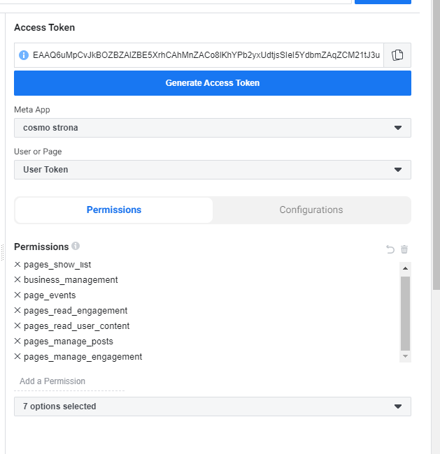

## General Information

A description for **Facebook API** usage details.

## Projects

Currently, there exist the next projects:
* **cosmopk** app(prod)
* **cosmopk** app dev test(local)

Access should include the next permissions:
* **pages_show_list** 
* **business_management** 
* **page_events** 
* **pages_read_engagement** 
* **pages_manage_posts** 
* **pages_manage_engagement**

In order to get an access, please communicate with the coordinator.

## Authentication

Access Token should be generated in the following way:


In case of success, please call the next API endpoint:

```shell
curl https://graph.facebook.com/v23.0/me/accounts?access_token={access_token}
```

It would result in the next response:

```json
{
  "data": [
    {
      "access_token": "",
      "category": "",
      "category_list": [
        {
          "id": "",
          "name": ""
        }
      ],
      "name": "",
      "id": "",
      "tasks": [
      ]
    }
  ],
  "paging": {
    "cursors": {
      "before": "",
      "after": ""
    }
  }
}
```

For more detailed exploration, please reach **Meta Graph API Explorer**: https://developers.facebook.com/tools/explorer

In order to get certain account details, select certain **access_token**(named as **Page Access Token**) and **id**

```shell
curl https://graph.facebook.com/{{id}}/feed?access_token={{access_token}}
```

This would result in the next response:
```json
{
  "data": [
    {
      "id": "1353269864728879_1943344825721377"
    },
    {
      "id": "1353269864728879_1943378089051384"
    },
    {
      "id": "1353269864728879_1942095249179668"
    }
  ]
}
```

No additional fields are provided by default. To selected desired fields and retrieve certain information please reach out this docs page: https://developers.facebook.com/docs/graph-api/reference/v23.0/page/feed