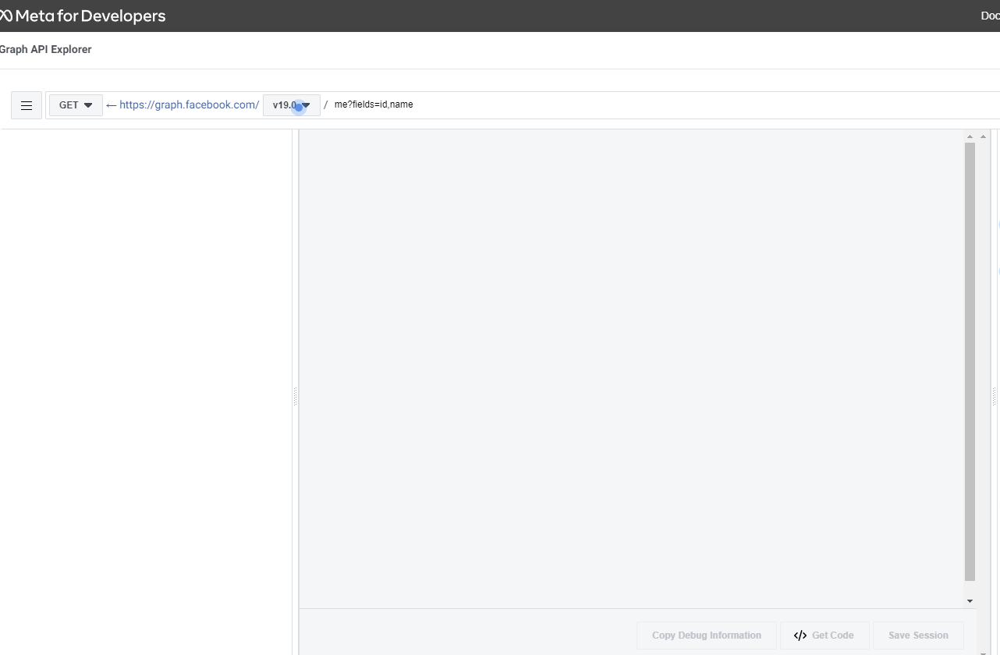
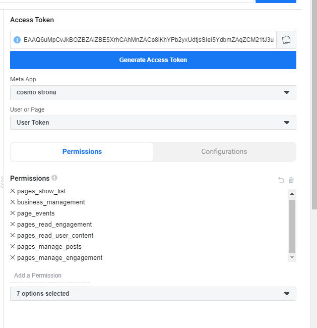

= Spring Boot Application Documentation
:doctype: book
:icons: font
:toc: left
:toclevels: 4
:sectlinks:
:sectnums:

== Overview

This document provides simple and clear overview of facebook api usage in
cosmo backend cases.

== Introduction
Currently there are two apps created in meta developer console (one for prod and one for testing).
Test user is created as well, but unfortunately due to meta api issues, bypass with
fake account had to be introduced. Once patch on facebook site will be provided (It has not been since 1 year :) ),
then it will be changed.

.Projects:
     * cosmopk app
     * cosmopk app dev test

Due to obvious reasons test is only granted for each webdev user, access to prod and actual website
is only available to coordiantor, or experienced person.

== Testing and Graph console

=== Prerequisites
. In order to be able to test it, you have to contact cooridantor for password and email.
. Basic knowledge of meta API (what is what and where is what XD)

=== API Authentication (Access Token)

.Currently, facebook supports 3 different types of access tokens:
    . User access token -> simple and most common token type (which we will be using) for
        calling API in most cases
    . Page access token -> more difficult to obtain token which will require permissions.
        It is used fe. to simple POST / PUT / GET on posts.
    . App access token -> wont describe it here, sorry :c.

DISCLAIMER:
It is simply my observations, and information may change, so in order
to be as updated as You can be, read docs!

=== Permissions
We will be using below list of permissions, which will allow us to obtain page token
and access valuable resources.

. pages_show_list
. business_management
. page_events
. pages_read_engagement
. pages_manage_posts
. pages_manage_engagement

=== Basic flow
After logging in and getting familiar with their API, it is time to etner graph api explorer.
Most likely You will bwe welcomed with given screen:



Then it is time to generate your first USER ACCESS TOKEN. This distinguishement is very important!
After assigning correct permissions, app, press generate access token. It should more or less look like this:



Then if everything worked out You should be able to call https://graph.facebook.com/v19.0/me/accounts.
It should return more or less sth like this

```
{
  "data": [
    {
      "access_token": "",
      "category": "",
      "category_list": [
        {
          "id": "",
          "name": ""
        }
      ],
      "name": "",
      "id": "",
      "tasks": [
      ]
    }
  ],
  "paging": {
    "cursors": {
      "before": "",
      "after": ""
    }
  }
}
```

From this part You have to take access_token and data.id, which will be Your PAGE ACCESS TOKEN.

Then with this token please open external tool (like postman)

```
Method: Get
URL: https://graph.facebook.com/{{pageId}}/feed?access_token={{token}}
```

which should return 200, with basic posts data structure.